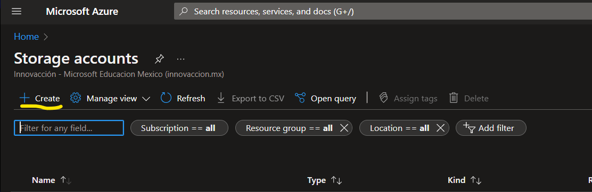

# En este apartado se vera como crear una cuenta de almacenamiento en Azure (Blob Storage):
- Primero debemos ir a la pagina de [Portal azure](https://portal.azure.com/#home) y buscaremos "cuenta de almacenamiento" y daremos en crear:

- Llenamos todos los datos que nos pide y creamos :

- Una ves creado debemos ir al recurso y al apartado de contenenedores y crearemos uno llenano lo que nos pide:

- Entramos al contendor que acabamos de crear:

Al entrar solo tendremos que dar en el boton de subir escojeremos el archivo que desamos guardadar en blob storage y listo!

- Para ver las opciones de lo que acabos de subir, basta con clickear en la carpeta y tendremos la informacion de esta asi como poder descargarla o copiar el link para visualizar lo que hemos cargado a blob storage 

# En este apartado se creara una cuenta de almacenamiento en Azure (File Storage)

Teniendo creado nuestra cuenta de almacenamiento nos iremos al apartado de "Recursos compartidos de archivos" y llenaremos los datos que nos piden y crearemos:

Entramos a el apartado que se creo y podemos subir nuestros archivos:

# En este apartado se creara una cuenta de almacenamiento en Azure (Queue Storage)

Teniendo creado nuestra cuenta de almacenamiento nos iremos al apartado de "Colas" 
- Agregaremos un nombre a la cola e ingresaremos al archivo que nos genere:

- Al cargar podremos subir los mensajes que queramos que esten en cola para su uso en futuros proyectos:

# En este apartado se creara una cuenta de almacenamiento en Azure (Table Storage)

Teniendo creado nuestra cuenta de almacenamiento nos iremos al apartado de "Tablas"
-Crearemos nuestra tabla escribiendo el nombre que queramos que tenga nuestra tabla y aceptamos:

Sin embargo desde este apartado no se pueden editar las tablas por lo que nos dirigiremos al apartado de "Explorador de almacenamiento" y nos aparecera el nomre de la tabla que acabamos de crear:
  
Desde este apartado podemos rellenar con datos nuestra tabla que creamos (clikeando en agregar identidad)

